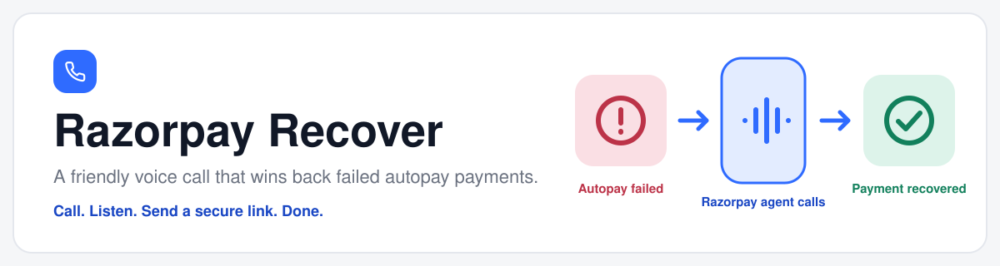
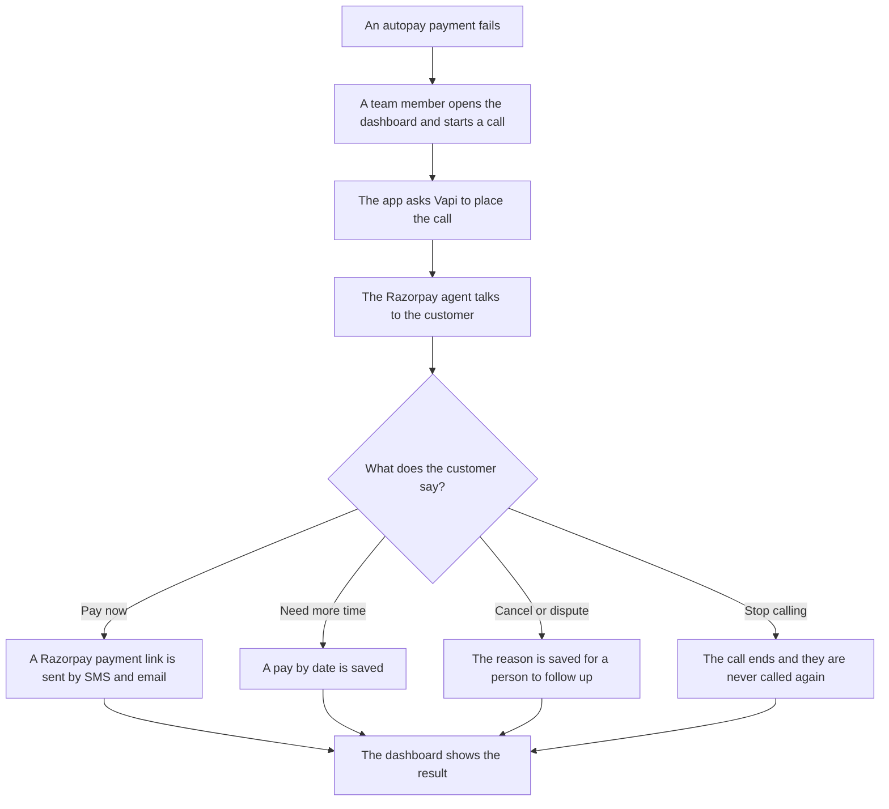
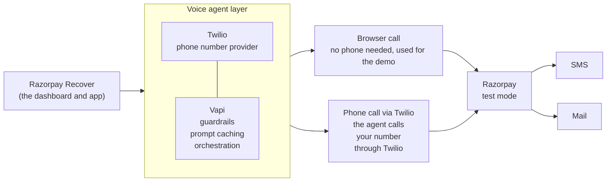

<p align="center">
  
</p>

# Razorpay Recover

**A friendly voice call that wins back failed autopay payments.**

Razorpay Recover is an internal tool. When a customer's automatic payment fails, the Razorpay agent, an AI voice agent, phones them, explains what happened, and sends a secure payment link while they are still on the line.

## The problem

Automatic payments fail all the time, and most of the reasons are ordinary: the card expired, the account was short that day, the bank said no.

Most of these customers still want to pay. They just never find out. An email gets buried, a text gets ignored, and the subscription lapses. The business loses money, and the customer loses a service they wanted.

Calling each person by hand does not scale, and a robotic call that pressures people makes things worse.

## The solution

The Razorpay agent makes the call for you.

1. It phones the customer and checks it is speaking to the right person.
2. It explains, in a sentence, that the payment did not go through and why.
3. It asks if they would like to pay now.
4. If they say yes, a secure Razorpay payment link arrives by SMS and email, while the call is still going. They pay by UPI or card.
5. If they need time, want to cancel, or think the charge is wrong, the agent notes it down and a person follows up.

Every call ends with a short record: what happened, whether the customer plans to stay, and if not, why. The team sees it on the dashboard, together with the transcript, the recording and what the call cost.

## What you can do in the dashboard

| Page | What it is for |
|---|---|
| **Overview** | Recovery numbers, outcomes, recent activity, and call usage: spend, tokens and prompt caching |
| **Customers** | The 10 customers with failed autopay. Start a phone call, or talk to the agent in your browser |
| **Test customers** | Add your own customer with a name, phone, email and a failure case, then call them. Saved to the database |
| **Calls** | An inbox of every call. Open one to see the summary, cost, tokens, the transcript synced to the audio, and a download for the recording and the transcript |
| **Payment links** | Every link the agent sent, and whether it was paid |
| **Settings** | Call limits, what the agent says when the customer goes quiet, SMS and email for the link, recording, and hiding sensitive details in transcripts |

There are two ways to test:
- **Call now** rings the number saved on the customer. It needs a phone number set up in Vapi, see [docs/TWILIO.md](docs/TWILIO.md).
- **Talk in browser** opens a side panel and uses your microphone. It needs no phone number, and it shows an animation of who is speaking.

## How it fits together



The parts and their jobs:



| Part | Job |
|---|---|
| Razorpay Recover | The dashboard and app. It starts calls, holds the rules, creates payment links and saves results |
| Twilio | The phone number provider. Browser calls do not use it |
| Vapi | Runs the conversation, with the guardrails, the prompt caching and the orchestration |
| Browser call | Talk to the agent through your microphone, with no phone. The easy way to demo |
| Phone call | The agent rings a real number through the Twilio provider |
| Razorpay, test mode | Creates the secure payment link. No real money moves |
| SMS and Mail | How the link reaches the customer |

The database keeps customers, call results and settings. The full picture, with the order of events inside a call, is in [docs/ARCHITECTURE.md](docs/ARCHITECTURE.md).

## How a call works, turn by turn

A turn is one thing the agent says, followed by one thing the customer says. The agent keeps each turn short.

| Turn | Agent | Customer | What the app does |
|---|---|---|---|
| 1 | "Hello, am I speaking with Fleming John?" | "Yes." | Nothing yet |
| 2 | "Your autopay for Super Plan did not go through. Would you like to pay now?" | "Yes, send it." | Nothing yet |
| 3 | "Done. A secure link is on its way to you now." | "Thanks." | Creates a Razorpay payment link and sends it, then saves the outcome |
| 4 | "Thank you. Goodbye." | | Saves the result and ends the call |

Other turns are handled the same way:

- **"I need a few days."** The agent asks for a date within the next seven days and saves it. No link is sent.
- **"I want to cancel."** The agent asks once for the reason, thanks them, and does not argue.
- **"That charge is wrong."** The agent says a person will follow up and saves it as a dispute.
- **"Stop calling me."** The agent apologises, ends the call, and the customer is never called again.
- **Silence.** After a few seconds the agent asks "Are you still there?". If nobody speaks for 30 seconds, the call ends.

The rules for each turn:

- Two short sentences at most.
- One question at a time, then the agent waits.
- Amounts are said in words.
- If the customer interrupts, the agent stops and listens.
- A call ends after three minutes at most. All of these limits can be changed in Settings.

## Guardrails

Guardrails are the rules that keep the agent safe, honest and polite. They work in three layers, so no single failure can cause harm.

**1. Rules in the prompt**

These are written in [`src/prompts/guardrails.md`](src/prompts/guardrails.md) and override everything else the agent is told.

- Never ask for a card number, CVV, OTP, PIN or password. Payment happens only through the link.
- Confirm identity by name only. If it is the wrong person, say you will call back and end the call without mentioning the amount.
- If the customer asks to stop, apologise, record it and end the call.
- Never threaten, never mention legal action, never pressure.
- Never promise discounts, waivers or refunds.
- Stay on the topic of this payment.

**2. Limits on the call itself**

- A longest call length, 180 seconds by default.
- An idle check and a hang-up after silence.
- Card details in the transcript are replaced with labels before the agent hears them. This is on by default and can be changed in Settings.
- The agent is told never to leave payment details on a voicemail.

**3. Rules our own code enforces**

The AI writes the words, but it does not control the money. These checks run in our app, and the AI cannot override them.

- The amount always comes from the customer record, never from what the AI says.
- A payment link is sent only after the customer has agreed to pay.
- Customers who have already paid or asked to stop are skipped.
- Calls go only to the phone number saved on the customer record. The test form asks you to confirm you have permission to call that number.

## What gets saved after each call

After the call, the app saves a short record. The format is in [`src/schemas/callOutcomeSchema.json`](src/schemas/callOutcomeSchema.json).

| Field | What it tells you |
|---|---|
| outcome | Paid now, promised to pay, disputed, wants to cancel, asked to stop, or no answer |
| willContinueSubscription | Yes, no or undecided |
| cancelReason | Too expensive, not using it, switched provider, billing error, other, or none |
| confirmedFailureReason | The reason the customer gives for the failure |
| paymentMethodChange | Whether they want to switch card or UPI |
| promiseDate | The date they promised to pay by |
| needsHumanFollowup | Whether a person should call back |
| sentiment | Positive, neutral or annoyed |

The Calls page also shows the transcript with the time of each line, the recording, the call length, the cost, and the tokens used. Cost, tokens and the recording come from Vapi when you open a call.

## Cost and tokens

Vapi reports what each call cost and how many AI tokens it used. The dashboard shows both on every call and as totals on the Overview page. Costs are in US dollars.

From the first real calls:

| Call | Length | Cost |
|---|---|---|
| Phone call | 52 seconds | $0.07 |
| Browser call | 104 seconds | $0.14 |

A connected call costs about $0.08 a minute. Most of that is the Vapi platform fee, then the voice, then speech recognition. The AI model is under 2%.

Prompt caching is automatic. The AI model reuses the repeated start of the prompt, and Vapi reports how many tokens were reused. The Overview page shows that as a percentage. There is nothing to set up.

Twilio charges separately for the phone call, see [docs/TWILIO.md](docs/TWILIO.md).

## Privacy and data

The app handles names, phone numbers, emails, amounts, call audio and transcripts. They pass through Vapi, the AI model, speech recognition and voice providers, Razorpay, Twilio and Supabase.

What is in place:
- The agent never asks for card details, OTPs or PINs.
- Card details in transcripts are redacted by default. Personal details can be redacted too, in Settings.
- Recording can be turned off in Settings.
- Keys live in `.env`, which git ignores.

Redaction applies to transcripts. Audio recordings are not changed.

## Tech stack

| What | Used for |
|---|---|
| Next.js and TypeScript | The dashboard and the app behind it |
| Vercel | Hosting |
| Vapi | Placing the call and running the conversation, including the browser call |
| OpenAI `gpt-4o-mini` | The agent's reasoning, through Vapi |
| Deepgram | Speech to text, through Vapi |
| ElevenLabs | The agent's voice, through Vapi |
| A phone number from Twilio, Vonage or Telnyx | The number the agent calls from, imported into Vapi |
| Razorpay Payment Links, test mode | Secure payment links with no real money moving |
| Supabase (Postgres) | Saving customers, call results and settings |

There is no workflow framework such as LangGraph. Vapi runs the conversation and the script is short and fixed, so a clear prompt and two tools cover it.

## Project layout

```
razorpay-recover
├── src
│   ├── app          the pages and the routes the dashboard calls
│   ├── calls        starting and ending calls, and reading what Vapi sends back
│   ├── components   the pieces of each screen
│   ├── customers    reading, adding and checking customers
│   ├── hooks        screen logic
│   ├── lib          small helpers
│   ├── payments     Razorpay payment links
│   ├── prompts      what the agent is told, one file per section
│   ├── schemas      the shape of the saved call result
│   ├── settings     the saved settings and their checks
│   ├── styles       colour tokens and styles
│   └── types        one type per file
├── supabase         the SQL that creates the tables
├── docs             architecture, setup guides and the plan
├── PROMPTS.md       how the prompt is built and changed
└── LICENSE
```

The prompt files in `src/prompts`:

| File | What it holds |
|---|---|
| identity.md | Who the agent is and how it sounds |
| responseGuidelines.md | How short and plain each reply should be |
| guardrails.md | The hard rules |
| context.md | The customer's details for this call |
| workflow.md | The steps of the call |
| errorHandling.md | What to do when the call goes off script |
| examples.md | Sample conversations |
| toolSendPaymentLink.md | When to send a payment link |
| toolLogOutcome.md | When to record how the call ended |

## Getting started

Setup takes a few short steps: install, create the database tables, fill in `.env`, start the app, give Vapi a public address, and try a call. The full guide, with every setting and the common problems, is in [docs/LOCAL_SETUP.md](docs/LOCAL_SETUP.md).

The short version:

```
git clone <your repository address>
cd razorpay-recover
npm install
copy .env.example .env
npm run dev
```

On Mac or Linux, use `cp` instead of `copy`. Then open http://localhost:3000.

Before the first call you need:

- The two SQL files in `supabase/migrations` run in your Supabase project.
- The keys filled in `.env`.
- A public address for Vapi to send messages to, either the deployed site or a tunnel.
- For phone calls, a phone number imported into Vapi, see [docs/TWILIO.md](docs/TWILIO.md). Browser calls need none.

## Deploying to Vercel

The project includes `vercel.json`. With the Vercel command line tool:

```
vercel link
vercel deploy --prod
```

Add the same settings as in `.env` to the Vercel project first, and set `PUBLIC_BASE_URL` to the site's address.

## Known limits

- **No login.** Anyone with the address can use the dashboard. Do not leave it open with real data.
- **Twilio trial.** A trial account can only call numbers verified in Twilio, and the person may hear a trial message first. See [docs/TWILIO.md](docs/TWILIO.md).
- **Paid status is not instant.** A payment is noticed when the Payment links page is opened. A live Razorpay notification is not built yet.
- **No automated tests.**
- **Phone layout** has not been checked on a real phone.

## Changing the agent

Edit the files in `src/prompts`. Follow [PROMPTS.md](PROMPTS.md) so each change stays short and safe.

## License

Released under the [MIT License](LICENSE).
