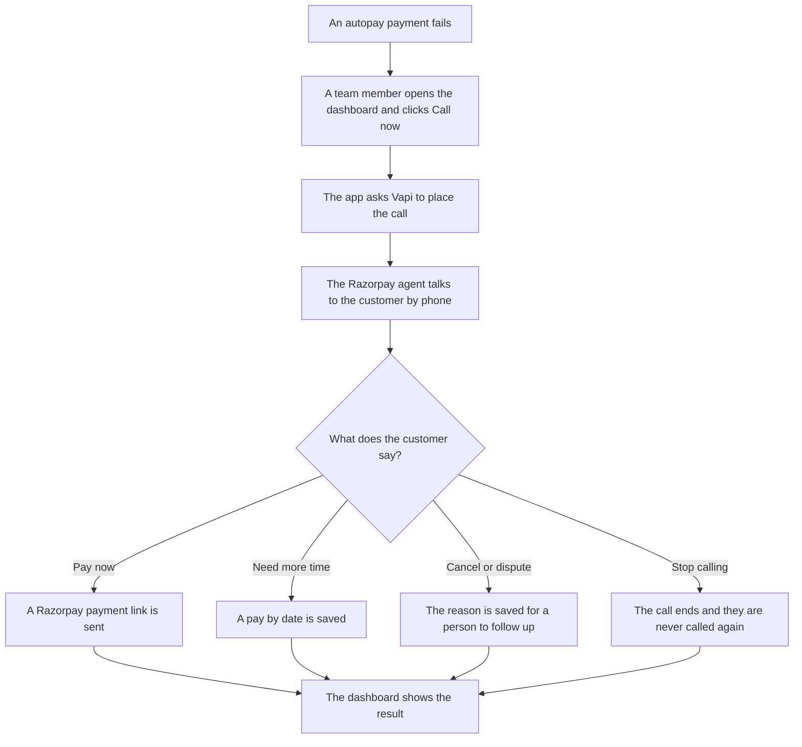
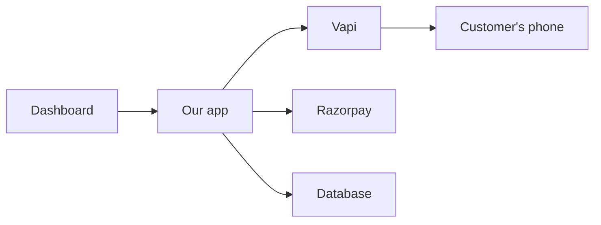

<p align="center">
  
</p>

# Razorpay Recover

**A friendly voice call that wins back failed autopay payments.**

Razorpay Recover is an internal tool. When a customer's automatic payment fails, the Razorpay agent, an AI voice agent, phones them, explains what happened, and sends a secure payment link while they are still on the line.

> **Status: work in progress.** The prompts, the call result format, the customer records and the colour tokens are written. The dashboard, the call trigger and the payment link step are the next things to build.

## The problem

Automatic payments fail all the time, and most of the reasons are ordinary: the card expired, the account was short that day, the bank said no.

Most of these customers still want to pay. They just never find out. An email gets buried, a text gets ignored, and the subscription lapses. The business loses money, and the customer loses a service they wanted.

Calling each person by hand does not scale, and a robotic call that pressures people makes things worse.

## The solution

The Razorpay agent makes the call for you.

1. It phones the customer and checks it is speaking to the right person.
2. It explains, in a sentence, that the payment did not go through and why.
3. It asks if they would like to pay now.
4. If they say yes, a secure Razorpay payment link arrives by message. They pay by UPI or card.
5. If they need time, want to cancel, or think the charge is wrong, the agent notes it down and a person follows up.

Every call ends with a short record: what happened, whether the customer plans to stay, and if not, why. The team sees it on the dashboard.

## How it fits together



The parts and their jobs:



| Part | Job |
|---|---|
| Dashboard | Where the team sees customers, starts calls and reads results |
| Our app | Holds the rules, creates payment links and saves results |
| Vapi | Places the call and handles the talking and listening |
| Razorpay | Creates the secure payment link |
| Database | Keeps the call results |

## How a call works, turn by turn

A turn is one thing the agent says, followed by one thing the customer says. The agent keeps each turn short.

| Turn | Agent | Customer | What the app does |
|---|---|---|---|
| 1 | "Hello, am I speaking with Aarav?" | "Yes." | Nothing yet |
| 2 | "Your autopay for Streaming Plus did not go through. Would you like to pay now?" | "Yes, send it." | Nothing yet |
| 3 | "Done. A secure link is on its way to you now." | "Thanks." | Creates a Razorpay payment link and sends it |
| 4 | "Thank you. Goodbye." | | Saves the result and ends the call |

Other turns are handled the same way:

- **"I need a few days."** The agent asks for a date within the next seven days and saves it.
- **"I want to cancel."** The agent asks once for the reason, thanks them, and does not argue.
- **"That charge is wrong."** The agent says a person will follow up and saves it as a dispute.
- **"Stop calling me."** The agent apologises, ends the call, and the customer is never called again.

The rules for each turn:

- Two short sentences at most.
- One question at a time, then the agent waits.
- Amounts are said in words.
- If the customer interrupts, the agent stops and listens.
- A call ends after three minutes at most.

## Guardrails

Guardrails are the rules that keep the agent safe, honest and polite. They work in three layers, so no single failure can cause harm.

**1. Rules in the prompt**

These are written in [`src/prompts/guardrails.md`](src/prompts/guardrails.md) and override everything else the agent is told.

- Never ask for a card number, CVV, OTP, PIN or password. Payment happens only through the link.
- Confirm identity by name only. If it is the wrong person, say you will call back and end the call without mentioning the amount.
- If the customer asks to stop, apologise, record it and end the call.
- Never threaten, never mention legal action, never pressure.
- Never promise discounts, waivers or refunds.
- Stay on the topic of this payment.

**2. Limits on the call itself**

- A maximum call length of 180 seconds.
- If the call reaches voicemail, no payment details are left.

**3. Rules our own code enforces**

The AI writes the words, but it does not control the money. These checks run in our app, and the AI cannot override them.

- The amount always comes from the customer record, never from what the AI says.
- A payment link is sent only after the customer has agreed to pay.
- Customers who have already paid or asked to stop are skipped.
- Calls go only to the phone number saved on the customer record, which is the owner's own.

All customers in this project are fictional, and every call goes to a number the owner controls.

## What gets saved after each call

After the call, the app saves a short record. The format is in [`src/schemas/callOutcomeSchema.json`](src/schemas/callOutcomeSchema.json).

| Field | What it tells you |
|---|---|
| outcome | Paid now, promised to pay, disputed, wants to cancel, asked to stop, or no answer |
| willContinueSubscription | Yes, no or undecided |
| cancelReason | Too expensive, not using it, switched provider, billing error, other, or none |
| confirmedFailureReason | The reason the customer gives for the failure |
| paymentMethodChange | Whether they want to switch card or UPI |
| promiseDate | The date they promised to pay by |
| needsHumanFollowup | Whether a person should call back |
| sentiment | Positive, neutral or annoyed |

## Tech stack

| What | Used for |
|---|---|
| Next.js and TypeScript | The dashboard and the app behind it |
| Vercel | Hosting |
| Vapi | Placing the call and running the conversation |
| ElevenLabs | The agent's voice, through Vapi |
| A phone number from Twilio, Vonage or Telnyx | The number the agent calls from, imported into Vapi |
| Razorpay Payment Links, test mode | Secure payment links with no real money moving |
| Supabase (Postgres) | Saving customers and call results |

There is no workflow framework such as LangGraph. Vapi runs the conversation and the script is short and fixed, so a clear prompt and two tools cover it.

## Project layout

```
razorpay-recover
├── src
│   ├── prompts      what the agent is told, one file per section
│   ├── schemas      the shape of the saved call result
│   ├── customers    the fictional customer records
│   ├── types        one type per file
│   ├── lib          small helpers that build the prompt
│   ├── styles       colour tokens
│   ├── app          the pages
│   ├── calls        starting calls (to build)
│   ├── payments     payment links (to build)
│   ├── components   screen pieces (to build)
│   └── hooks        screen logic (to build)
├── PLAN.md          the plan and open questions
├── PROMPTS.md       how the prompt is built and changed
└── LICENSE
```

The prompt files in `src/prompts`:

| File | What it holds |
|---|---|
| identity.md | Who the agent is and how it sounds |
| responseGuidelines.md | How short and plain each reply should be |
| guardrails.md | The hard rules |
| context.md | The customer's details for this call |
| workflow.md | The steps of the call |
| errorHandling.md | What to do when the call goes off script |
| examples.md | Sample conversations |
| toolSendPaymentLink.md | When to send a payment link |
| toolLogOutcome.md | When to record how the call ended |

## Run it on your own computer

### What you need

- Node.js 20 or newer
- A Vapi account and its private API key
- A phone number imported into Vapi for outbound calls (Twilio, Vonage or Telnyx). Vapi's free numbers cannot place calls. See [docs/TWILIO.md](docs/TWILIO.md) for the full Twilio setup.
- A Razorpay account with test keys (Dashboard, Settings, API Keys, Generate Test Key)
- Your own mobile number, saved on the customer records. Use only a number you control or have explicit permission to call.

### Steps

1. **Get the code**
   ```
   git clone <your repository address>
   cd razorpay-recover
   ```

2. **Install the packages**
   ```
   npm install
   ```

3. **Create the database tables**

   In the Supabase dashboard open the SQL editor and run the file `supabase/migrations/20261002000000_create_tables.sql`. It creates the `customers` and `calls` tables and adds the two fictional customers.

4. **Create your settings file**

   On Windows:
   ```
   copy .env.example .env
   ```
   On Mac or Linux:
   ```
   cp .env.example .env
   ```

5. **Fill in `.env`**

   | Setting | Where to find it |
   |---|---|
   | VAPI_API_KEY | Vapi dashboard, API keys, the private key |
   | VAPI_PHONE_NUMBER_ID | Vapi dashboard, Phone Numbers, the ID of the number you imported |
   | RAZORPAY_KEY_ID | Razorpay test key ID, starts with `rzp_test_` |
   | RAZORPAY_KEY_SECRET | Razorpay test key secret |
   | VAPI_WEBHOOK_SECRET | Any long random text you choose. Our app checks it on every message from Vapi. |
   | SUPABASE_URL | Supabase project settings, API, the project URL |
   | SUPABASE_SECRET_KEY | Supabase project settings, API keys, the secret key (starts with `sb_secret_`). Server only, never share it. |
   | PUBLIC_BASE_URL | The public address Vapi can reach (see step 7) |

   Never commit `.env`. It is already in `.gitignore`.

6. **Start the app**
   ```
   npm run dev
   ```
   Open http://localhost:3000.

7. **Let Vapi reach your computer (needed for live calls)**

   Vapi sends messages back to your app during a call, so it needs a public address. Start a tunnel tool such as ngrok in a second terminal:
   ```
   ngrok http 3000
   ```
   Copy the address it prints into `PUBLIC_BASE_URL` and restart the app.

8. **Try a call**

   Click Call now for a customer. Your phone rings. Answer it and play the customer. Say you will pay, and a Razorpay test payment link is created. Then try the other paths: ask for more time, say you want to cancel, or ask it to stop calling.

### What works today

The dashboard (Overview, Customers, Calls, Payment links), the call trigger, the webhook that handles both tools, Razorpay payment links and result saving are built. The code type-checks and builds. I have not yet placed a live call, because that needs your Vapi number and keys, so treat the first call as the real test.

### Changing the agent

Edit the files in `src/prompts`. Follow [PROMPTS.md](PROMPTS.md) so each change stays short and safe.

## License

Released under the [MIT License](LICENSE).
