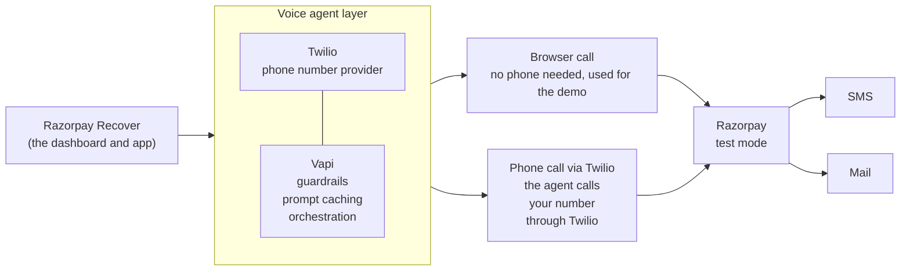

# Architecture

How the parts of Razorpay Recover fit together.

## The big picture

## What each part does

| Part | Job |
|---|---|
| **Razorpay Recover** | The dashboard and the app behind it. It starts calls, holds the rules, and saves results |
| **Voice agent layer** | Everything that talks to the customer |
| **Twilio** | The phone number provider. It gives the agent a number to call from. Browser calls do not use it |
| **Vapi** | Runs the conversation. It holds the guardrails, the prompt caching and the orchestration of listening, thinking and speaking |
| **Browser call** | Talk to the agent through your microphone. It needs no phone number, so it is the easy way to demo |
| **Phone call via Twilio** | The agent rings a real phone number through the Twilio provider |
| **Razorpay, test mode** | Creates the secure payment link. Test mode moves no real money |
| **SMS and Mail** | How Razorpay delivers the link to the customer |

## The two paths

Both paths use the same agent, the same prompt and the same guardrails. Only the way the customer hears the agent is different.

- **Browser call.** The dashboard opens a side panel. Your browser connects to Vapi directly, so no phone number and no Twilio is involved. It is meant for the demo and for testing.
- **Phone call.** The app asks Vapi to call the number saved on the customer. Vapi dials through the Twilio number, and the customer's phone rings.

## What happens inside a call

Once the agent is talking, the order of events is:

1. The agent greets the customer and explains the failed payment.
2. The customer agrees to pay.
3. The agent asks the app to send the payment link.
4. The app reads the amount from the customer record in the database.
5. The app asks Razorpay to create the link, and Razorpay sends it by SMS and mail.
6. The agent reports the outcome, and the app saves it.
7. When the call ends, Vapi sends the transcript, and the app saves the call.

Two things to notice:

- **The app creates the link, not the call.** The agent only asks. The app reads the amount from the database and calls Razorpay, so the AI can never change what is charged.
- **The database is the memory.** It holds the customers, every call with its summary, transcript and cost, and the settings.

## What the diagram does not show

- **The dashboard pages.** Overview, Customers, Test customers, Calls, Payment links and Settings are all part of Razorpay Recover.
- **Safety rules in our own code.** Skipping customers who have paid or opted out, and checking the secret on every message from Vapi.
- **Paid notifications.** A paid link is noticed when the Payment links page is opened. A live notification from Razorpay is not built yet, see [PLAN.md](PLAN.md).

## Where each part lives in the code

| Part | Folder |
|---|---|
| Dashboard pages and routes | `src/app` |
| Starting and ending calls, and reading what Vapi sends back | `src/calls` |
| Payment links | `src/payments` |
| Customers | `src/customers` |
| Saved settings | `src/settings` |
| What the agent is told | `src/prompts` |
| The tables | `supabase/migrations` |
